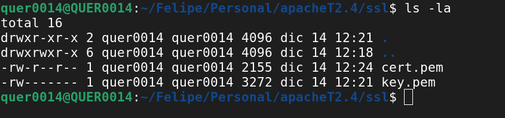

# Configuración de HTTPS en Apache

## Creación de los certificados

## Argumentos de la generación de los certificados

- ***x509:*** Tipo de certificado autofirmado(de prueba) x509.
- ***nodes:*** Si se específica este comando valida si hay una llave privada y entonces no se encripta.
- ***new:*** Genera una solicitud de valores relevantes para la generación del certificado.
- ***newkey:*** +"Args" Genera una solicitud de una nueva clave privada, teniendo en cuenta los "Args" donde se indica el tipo (rsa) y el número de bits (4096)
- ***days:*** Cantidad de días que el certificado de tipo x509 será válido.
- ***keyout:*** Nombre del archivo para escribir la clave privada.
- ***out:*** Nombre del archivo para escribir el certificado.